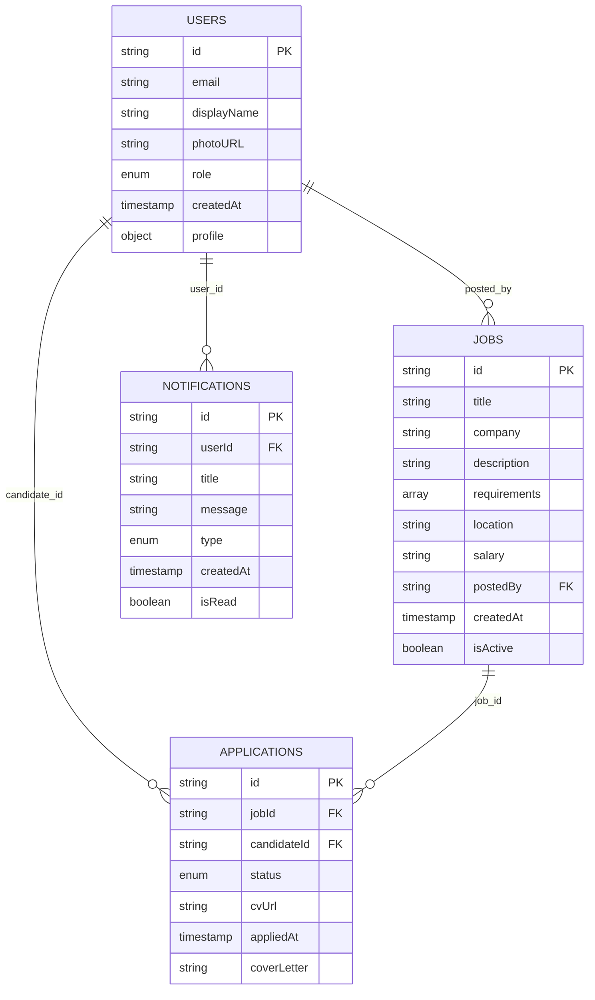

# 🗄️ TIMELESS - Diagramme de Base de Données

## 📋 Vue d'ensemble

**Type** : Firestore (NoSQL, Document-based)  
**Cloud Provider** : Firebase/Google Cloud  
**Synchronisation** : Temps réel  

---

## 🏗️ Architecture de la Base de Données

### **Principe NoSQL**
```
Collection → Document → Champs (Fields)
     ↓         ↓           ↓
   users → user123 → {email, name, role, ...}
```

### **Relations Firestore**
- **Pas de JOIN SQL** : Relations par références de documents
- **Dénormalisation** : Duplication volontaire pour performance
- **Requêtes rapides** : Index automatiques

---

## 📊 Schéma des Collections



---

## 📋 Collections Détaillées

### 👤 **Collection `users`**

```javascript
// Document ID: user_firebase_uid
{
  // === Identité ===
  "id": "uY8Kw2pL9mX3nR5tQ1",           // Firebase UID
  "email": "john.doe@example.com",       // Email unique
  "displayName": "John Doe",             // Nom d'affichage
  "photoURL": "https://...",             // Photo de profil
  
  // === Rôle & Permissions ===
  "role": "candidate",                   // "candidate" | "recruiter" | "admin"
  "isVerified": true,                    // Email vérifié
  "isActive": true,                      // Compte actif
  
  // === Métadonnées ===
  "createdAt": "2024-12-01T10:00:00Z",   // Date de création
  "lastLogin": "2024-12-01T10:00:00Z",   // Dernière connexion
  "deviceToken": "fcm_token_...",        // Token FCM pour notifications
  
  // === Profil Détaillé ===
  "profile": {
    // Informations personnelles
    "firstName": "John",
    "lastName": "Doe",
    "bio": "Développeur Flutter passionné par l'innovation",
    "phone": "+33 6 12 34 56 78",
    "dateOfBirth": "1995-06-15",
    "gender": "male",
    
    // Localisation
    "location": {
      "city": "Paris",
      "country": "France",
      "countryCode": "FR",
      "coordinates": {
        "lat": 48.8566,
        "lng": 2.3522
      }
    },
    
    // Compétences et Expérience
    "skills": [
      "Flutter", "Dart", "Firebase", 
      "React", "Node.js", "MongoDB"
    ],
    "experience": "3 ans",
    "education": "Master en Informatique",
    "languages": ["fr", "en", "es"],
    
    // Préférences Professionnelles
    "jobPreferences": {
      "desiredRole": "Développeur Mobile Senior",
      "salaryRange": {
        "min": 45000,
        "max": 60000,
        "currency": "EUR"
      },
      "workType": "hybrid",              // "remote" | "onsite" | "hybrid"
      "availability": "immediate"        // "immediate" | "2weeks" | "1month"
    },
    
    // URLs et Liens
    "socialLinks": {
      "linkedin": "https://linkedin.com/in/johndoe",
      "github": "https://github.com/johndoe",
      "portfolio": "https://johndoe.dev"
    },
    
    // CV et Documents
    "documents": {
      "cvUrl": "https://storage.firebase.../cv_john_doe.pdf",
      "portfolioUrl": "https://storage.firebase.../portfolio.pdf"
    }
  },
  
  // === Paramètres App ===
  "settings": {
    "language": "fr",                    // Langue préférée
    "notifications": {
      "email": true,
      "push": true,
      "sms": false
    },
    "privacy": {
      "profileVisible": true,
      "contactInfoVisible": false
    }
  }
}
```

### 💼 **Collection `jobs`**

```javascript
// Document ID: auto-generated
{
  // === Identifiants ===
  "id": "job_xyz789",                    // ID unique de l'emploi
  "slug": "developpeur-flutter-paris",   // URL-friendly identifier
  
  // === Informations de Base ===
  "title": "Développeur Flutter Senior",
  "company": "TechCorp Innovation",
  "companyLogo": "https://...",          // Logo de l'entreprise
  "description": "Rejoignez notre équipe dynamique...",
  
  // === Détails Techniques ===
  "requirements": [
    "Flutter/Dart (3+ ans)",
    "Firebase/Backend",
    "State Management (GetX/Bloc)",
    "API REST/GraphQL",
    "Git/CI-CD"
  ],
  "responsibilities": [
    "Développer des apps mobiles performantes",
    "Collaborer avec l'équipe design",
    "Maintenir la qualité du code"
  ],
  "benefits": [
    "Télétravail flexible",
    "Formation continue",
    "Tickets restaurant"
  ],
  
  // === Localisation ===
  "location": {
    "city": "Paris",
    "country": "France",
    "address": "123 Rue de la Tech",
    "remote": true,                      // Possibilité de télétravail
    "hybrid": true                       // Mode hybride possible
  },
  
  // === Rémunération ===
  "salary": {
    "min": 50000,
    "max": 65000,
    "currency": "EUR",
    "type": "yearly",                    // "yearly" | "monthly" | "hourly"
    "displayed": "50-65k€"              // Format d'affichage
  },
  
  // === Métadonnées ===
  "postedBy": "recruiter_abc123",        // ID du recruteur
  "createdAt": "2024-12-01T10:00:00Z",
  "updatedAt": "2024-12-01T10:00:00Z",
  "expiresAt": "2025-01-01T00:00:00Z",   // Date d'expiration
  
  // === Statut & Visibilité ===
  "isActive": true,                      // Offre active
  "isPremium": false,                    // Offre premium (mise en avant)
  "status": "open",                      // "open" | "closed" | "draft"
  "views": 245,                          // Nombre de vues
  "applicationsCount": 12,               // Nombre de candidatures
  
  // === Catégories & Tags ===
  "category": "tech",                    // Catégorie principale
  "subcategory": "mobile-development",   // Sous-catégorie
  "tags": ["flutter", "firebase", "senior"], // Tags de recherche
  "jobType": "full-time",                // "full-time" | "part-time" | "contract" | "internship"
  "experienceLevel": "senior",           // "junior" | "mid" | "senior" | "lead"
  
  // === Processus de Recrutement ===
  "hiringProcess": {
    "steps": [
      "CV Review",
      "Technical Interview", 
      "Team Interview",
      "Final Decision"
    ],
    "duration": "2-3 weeks",
    "hasTest": true                      // Test technique requis
  }
}
```

### 📝 **Collection `applications`**

```javascript
// Document ID: auto-generated
{
  // === Identifiants ===
  "id": "app_xyz789",
  "jobId": "job_abc123",                 // Référence vers jobs
  "candidateId": "user_def456",          // Référence vers users
  
  // === Statut de Candidature ===
  "status": "pending",                   // "pending" | "reviewing" | "interview" | "accepted" | "rejected"
  "stage": "cv_review",                  // Étape actuelle du processus
  "score": 85,                           // Score de matching (0-100)
  
  // === Documents et Fichiers ===
  "documents": {
    "cvUrl": "https://storage.../cv.pdf",
    "coverLetterUrl": "https://storage.../cover.pdf",
    "portfolioUrl": "https://storage.../portfolio.pdf"
  },
  
  // === Messages et Communication ===
  "coverLetter": "Je suis très intéressé par cette opportunité...",
  "candidateMessage": "Disponible immédiatement",
  "recruiterNotes": "Profil intéressant, à recontacter",
  "feedback": "Compétences techniques solides",
  
  // === Dates Importantes ===
  "appliedAt": "2024-12-01T10:00:00Z",   // Date de candidature
  "reviewedAt": "2024-12-02T14:00:00Z",  // Date de première review
  "respondedAt": "2024-12-03T09:00:00Z", // Date de réponse recruteur
  "updatedAt": "2024-12-03T09:00:00Z",
  
  // === Informations de Matching ===
  "matchingData": {
    "skillsMatch": 0.8,                  // % de correspondance compétences
    "locationMatch": 1.0,                // % de correspondance géographique
    "experienceMatch": 0.9,              // % de correspondance expérience
    "salaryMatch": 0.7,                  // % de correspondance salaire
    "overallScore": 0.85                 // Score global de matching
  },
  
  // === Processus de Recrutement ===
  "interviews": [
    {
      "type": "phone",
      "scheduledAt": "2024-12-05T15:00:00Z",
      "duration": 30,
      "interviewer": "Marie Dupont",
      "status": "scheduled"              // "scheduled" | "completed" | "cancelled"
    }
  ],
  
  // === Métadonnées ===
  "source": "direct_apply",              // "direct_apply" | "recommended" | "smart_match"
  "isBookmarked": false,                 // Candidature marquée par le recruteur
  "priority": "normal"                   // "low" | "normal" | "high"
}
```

### 🔔 **Collection `notifications`**

```javascript
// Document ID: auto-generated
{
  // === Identifiants ===
  "id": "notif_xyz789",
  "userId": "user_abc123",               // Destinataire
  
  // === Contenu ===
  "title": "Nouvelle candidature reçue",
  "message": "John Doe a postulé pour le poste de Développeur Flutter",
  "imageUrl": "https://...",             // Image optionnelle
  
  // === Type et Actions ===
  "type": "application_received",        // Type de notification
  "category": "job_application",         // Catégorie
  "actionUrl": "/applications/app_xyz",  // URL de redirection
  "actionText": "Voir la candidature",   // Texte du bouton
  
  // === Données Contextuelles ===
  "data": {
    "jobId": "job_abc123",
    "applicationId": "app_xyz789",
    "candidateId": "user_def456",
    "jobTitle": "Développeur Flutter Senior"
  },
  
  // === Statut ===
  "isRead": false,                       // Lu/non lu
  "isClicked": false,                    // Cliqué/non cliqué
  "isSent": true,                        // Envoyé avec succès
  
  // === Dates ===
  "createdAt": "2024-12-01T10:00:00Z",
  "readAt": null,                        // Date de lecture
  "expiresAt": "2024-12-31T23:59:59Z",   // Date d'expiration
  
  // === Canaux d'Envoi ===
  "channels": {
    "push": true,                        // Notification push
    "email": false,                      // Email
    "sms": false                         // SMS
  },
  
  // === Priorité ===
  "priority": "normal"                   // "low" | "normal" | "high" | "urgent"
}
```

---

## 🔍 Index et Performance

### **Index Firestore Recommandés**

```javascript
// Collection: jobs
{
  "fields": ["isActive", "createdAt"],
  "order": "desc"
}

// Collection: applications  
{
  "fields": ["candidateId", "status", "appliedAt"],
  "order": "desc"
}

// Collection: notifications
{
  "fields": ["userId", "isRead", "createdAt"], 
  "order": "desc"
}
```

### **Requêtes Optimisées**

```dart
// Récupérer les emplois actifs
FirebaseFirestore.instance
  .collection('jobs')
  .where('isActive', isEqualTo: true)
  .orderBy('createdAt', descending: true)
  .limit(20);

// Candidatures d'un utilisateur
FirebaseFirestore.instance
  .collection('applications')
  .where('candidateId', isEqualTo: userId)
  .orderBy('appliedAt', descending: true);
```

---

## 🔒 Règles de Sécurité Firestore

### **Contrôle d'Accès**

```javascript
rules_version = '2';
service cloud.firestore {
  match /databases/{database}/documents {
    
    // Users: lecture libre, écriture par le propriétaire
    match /users/{userId} {
      allow read: if true;
      allow write: if request.auth != null && request.auth.uid == userId;
    }
    
    // Jobs: lecture libre, écriture par les recruteurs
    match /jobs/{jobId} {
      allow read: if true;
      allow create, update: if request.auth != null && 
        get(/databases/$(database)/documents/users/$(request.auth.uid)).data.role == 'recruiter';
    }
    
    // Applications: accès limité aux parties concernées
    match /applications/{applicationId} {
      allow read, write: if request.auth != null && (
        resource.data.candidateId == request.auth.uid ||
        get(/databases/$(database)/documents/jobs/$(resource.data.jobId)).data.postedBy == request.auth.uid
      );
    }
    
    // Notifications: accès par le destinataire uniquement  
    match /notifications/{notificationId} {
      allow read, write: if request.auth != null && 
        resource.data.userId == request.auth.uid;
    }
  }
}
```

---

## 🚀 Avantages de cette Architecture

### ✅ **Performance**
- **Lectures rapides** : Documents dénormalisés
- **Temps réel** : Synchronisation automatique
- **Scale automatique** : Firebase gère la montée en charge

### ✅ **Flexibilité**
- **Schema-less** : Evolution facile des structures
- **Nested objects** : Données complexes dans un document
- **Array queries** : Recherche dans les listes

### ✅ **Sécurité**
- **Authentification** : Intégrée avec Firebase Auth
- **Règles granulaires** : Contrôle précis des accès
- **Audit trail** : Logs automatiques des opérations

---

## 📈 Monitoring et Analytics

### **Métriques Importantes**
- **Reads/Writes per second** : Performance base de données
- **Document count growth** : Croissance des données
- **Query performance** : Temps de réponse des requêtes
- **Storage usage** : Utilisation de l'espace

### **Alertes Firestore**
- Quota usage > 80%
- Slow queries > 1s
- Failed operations > 1%

---

**Cette architecture NoSQL est optimisée pour une application mobile temps réel avec une excellente expérience utilisateur.**