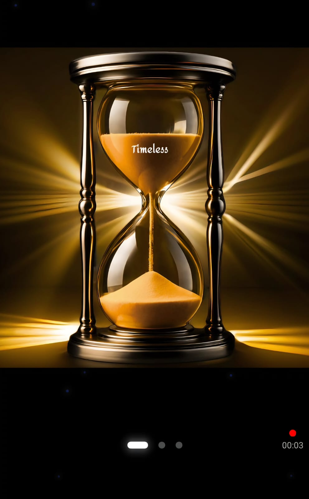

<h1 align="center">Timeless</h1>
<p align="center"><em>Because opportunities don’t wait...</em></p>


Timeless is a Flutter-based mobile job-search app powered by Firebase, designed for fast and accessible job applications. 
It provides an optimized job feed, intuitive navigation, and secure authentication, enabling candidates to apply anytime, anywhere. 


<p align="center"><small><em>See landing page by clicking below</em></small></p>
<p align="center">
  <a href="https://holbiwan.github.io/timeless-landing/">
    <a href="https://holbiwan.github.io/timeless-landing/">
  
</a>

  </a>
</p>

<p align="center">
  <a href="https://flutter.dev"></a>
  <a href="https://firebase.google.com"></a>
  
  
</p>


## 📸 Screenshots

A quick overview of the main user journey in **Timeless**.

### 🧭 Onboarding & Authentication
<p align="center">
  
  
</p>


  ### 👤 Candidate Experience
<p align="center">
  
   
</p>


### 🏢 Employer Experience (PRO)
<p align="center">
  
  
</p>


## 🎬 Demo
▶️ Watch the demo of the Timeless mobile application

<p align="center">
  <a href="https://youtu.be/UfaImt6-NZM">
    
  </a>
</p>


##  Project Structure

```bash
timeless/
├── android/              # Android specific configuration
├── ios/                  # iOS specific configuration
├── assets/               # Images, icons, translations, and demo data
├── lib/                  # Main Flutter application source code
│   ├── api/              # API clients and data services
│   ├── common/           # Reusable UI widgets
│   ├── config/           # App configuration (themes, constants, etc.)
│   ├── controllers/      # GetX controllers for state management
│   ├── models/           # Data models (Job, User, etc.)
│   ├── screen/           # Application screens (Authentication, Job List, etc.)
│   ├── services/         # Core services (Notifications, API, Storage)
│   ├── utils/            # Helper functions, formatters, and utilities
│   └── main.dart         # Application entry point
├── backend/              # Node.js / Express backend API
├── firebase/             # Firestore rules and indexes
└── tests/                # Flutter unit and widget tests
```

##  Tech Stack

### Mobile App

| Feature                  | Technology/Service                |
|--------------------------|-----------------------------------|
| Framework                | Flutter (Dart)                    |
| State Management         | GetX                              |
| Platform Support         | Android & iOS                     |
| Authentication           | Firebase Auth                     |
| Database                 | Firestore                         |
| Storage                  | Firebase Storage                  |
| Local Storage            | SharedPreferences                 |
| Notifications            | Firebase Cloud Messaging (FCM)    |

### Backend (`/backend`)

| Feature                  | Technology/Service                |
|--------------------------|-----------------------------------|
| Framework                | Node.js / Express                 |
| Database                 | MongoDB (with Mongoose)           |
| Authentication           | JWT (JSON Web Tokens)             |
| File Uploads             | Multer + Cloudinary               |
| Social Login             | Google OAuth (Passport)           |
| API Documentation        | Swagger                           |
| Testing                  | Jest + Supertest                  |

## Features Overview

| Feature / Service        | Purpose                                       |
|--------------------------|-----------------------------------------------|
| 🔐 **Firebase Auth**     | Handles user login via email and social providers (WIP). |
| 📊 **Firestore**         | Stores job offers, user profiles, and applications. |
| 📁 **Firebase Storage**  | Manages CV uploads and profile pictures.     |
| 🔔 **Notifications**     | Sends real-time alerts for jobs and updates.  |
| 💾 **SharedPreferences** | Saves local settings and authentication tokens. |
| 🌍 **Translations**      | Supports multiple languages using JSON files in `/assets/translations`. |

## 🚧 Installation & Run

1. **Clone the repository:**

    ```bash
    git clone https://github.com/your-account/timeless.git
    ```

2. **Navigate to the project directory:**

    ```bash
    cd timeless
    ```

3. **Install Flutter dependencies:**

    ```bash
    flutter pub get
    ```

4. **Run the application:**

    ```bash
    flutter run
    ```

⚠️ **Note:** Firebase configuration files (`google-services.json`, `GoogleService-Info.plist`, and `firebase_options.dart`) are not included in the repository for security reasons. You will need to set up your own Firebase project and add the configuration files to the appropriate locations (`android/app`, `ios/Runner`, and `lib/` respectively).

## 📜 License

This project is licensed under the MIT License.
