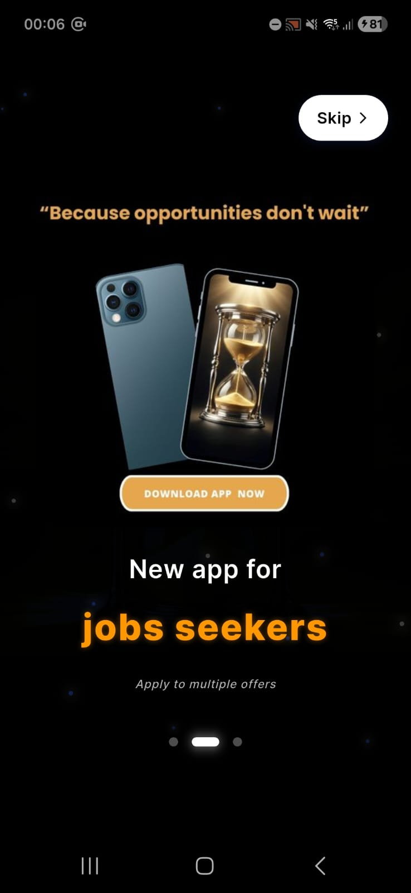
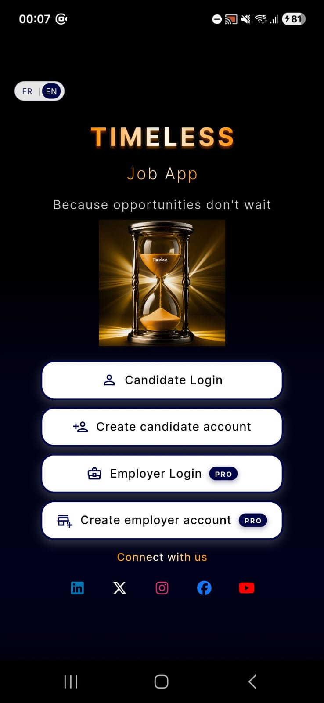
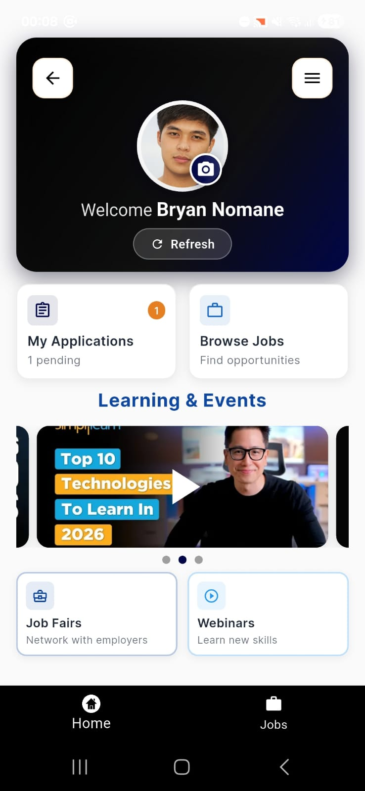
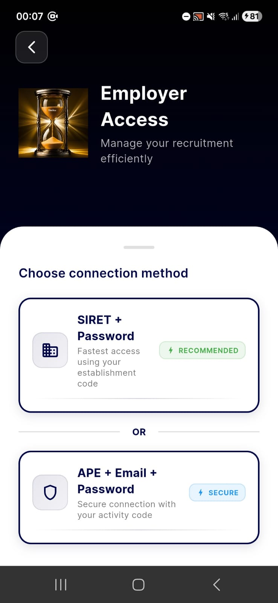

<div align="center">

# Timeless 
(Job search mobile app) 

#### *Because opportunities don't wait...*

[](https://flutter.dev)
[](https://firebase.google.com)
[](https://github.com/Holbiwan/timeless)
[](LICENSE)

**A modern Flutter job-search app powered by Firebase**
Fast, accessible, and intuitive job applications anytime, anywhere

[🎬 Watch Demo](https://github.com/Holbiwan/timeless/releases/download/v1.0-demo/Timeless.demo.mp4) • [🌐 Landing Page](https://holbiwan.github.io/timeless-landing/) • [📱 Screenshots](#-screenshots)


</div>

## 📖 Table of Contents

- [About](#-about)
- [Demo](#-demo)
- [Screenshots](#-screenshots)
- [Key Features](#-key-features)
- [Tech Stack](#-tech-stack)
- [Project Structure](#-project-structure)
- [Quick Start](#-quick-start)
- [Testing](#-testing)
- [License](#-license)


### About

**Timeless** is a Flutter-based mobile application designed to simplify the job search and application process. Built with Firebase, it offers a seamless experience for both **job seekers** and **employers**.

### ✨ Highlights

- 🚀 **Fast & Responsive** - Optimized performance with GetX state management
- 🔒 **Secure Authentication** - Firebase Auth with email and Google Sign-In
- 🌍 **Multi-language Support** - Available in English, French, and Spanish
- 📱 **Cross-Platform** - Works on Android and iOS
- 💼 **Dual User Roles** - Separate experiences for candidates and employers

> *This is a school portfolio project using fictitious data for demonstration purposes.*


## 🎬 Demo

<div align="center">

### 📹 Watch the Application in Action

[](https://github.com/Holbiwan/timeless/releases/download/v1.0-demo/Timeless.demo.mp4)

*Experience the complete user journey for both candidates and employers*

</div>


## 📸 Screenshots

<div align="center">

### 🧭 Onboarding & Authentication

<table>
  <tr>
    <td align="center">
      
      <br />
      <sub><b>Splash Screen</b></sub>
    </td>
    <td align="center">
      
      <br />
      <sub><b>Login</b></sub>
    </td>
  </tr>
</table>

### 👤 Candidate Experience

<table>
  <tr>
    <td align="center">
      
      <br />
      <sub><b>Candidate Login</b></sub>
    </td>
    <td align="center">
      
      <br />
      <sub><b>Job Feed</b></sub>
    </td>
  </tr>
</table>

### 🏢 Employer Experience

<table>
  <tr>
    <td align="center">
      
      <br />
      <sub><b>Employer Login</b></sub>
    </td>
    <td align="center">
      
      <br />
      <sub><b>Employer Dashboard</b></sub>
    </td>
  </tr>
</table>

</div>


## 🎯 Key Features

<table>
<tr>
<td width="50%">

### For Job Seekers 👤

- ✅ **Smart Job Search** - Filter by location, category, and type
- ✅ **Quick Apply** - Submit applications with CV in seconds
- ✅ **Save Favorites** - Bookmark jobs for later review
- ✅ **Track Applications** - Monitor application status in real-time
- ✅ **Profile Management** - Build and update your professional profile
- ✅ **Multi-language** - Switch between EN, FR, ES

</td>
<td width="50%">

### For Employers 🏢

- ✅ **Post Jobs** - Create and manage job offers easily
- ✅ **Review Applications** - View CVs and candidate profiles
- ✅ **Manage Candidates** - Track and update application statuses
- ✅ **Dashboard Analytics** - Monitor job posting performance
- ✅ **Company Profile** - Showcase your organization
- ✅ **Real-time Updates** - Get notified of new applications

</td>
</tr>
</table>


## 🛠 Tech Stack

<div align="center">

### Mobile Application


</div>

| Category              | Technology                        |
|-----------------------|-----------------------------------|
| **Framework**         | Flutter (Dart)                    |
| **State Management**  | GetX                              |
| **Authentication**    | Firebase Auth + Google Sign-In    |
| **Database**          | Cloud Firestore                   |
| **Storage**           | Firebase Storage                  |
| **Notifications**     | Firebase Cloud Messaging (FCM)    |
| **Localization**      | Easy Localization (EN, FR, ES)    |
| **Local Storage**     | SharedPreferences                 |
| **File Handling**     | File Picker                       |


## 📁 Project Structure

<details>
<summary><b>Click to expand project structure</b></summary>

```bash
timeless/
├── android/              # Android configuration
├── ios/                  # iOS configuration
├── macos/                # macOS configuration
├── web/                  # Web platform support
│
├── assets/               # Application assets
│   ├── cv/               # Demo CV files
│   ├── icons/            # App icons
│   ├── images/           # Images and logos
│   ├── screenshots/      # App screenshots
│   ├── translations/     # i18n files (en, fr, es)
│   └── jobs.json         # Demo job data
│
└── lib/                  # Main Flutter source code
    ├── api/              # API clients and services
    ├── common/           # Reusable widgets
    ├── config/           # App configuration
    ├── controllers/      # GetX controllers
    ├── models/           # Data models
    │   ├── job_offer_model.dart
    │   ├── user_model_unified.dart
    │   └── application_model.dart
    ├── screen/           # UI screens
    │   ├── auth/         # Authentication
    │   ├── candidate/    # Candidate screens
    │   ├── employer/     # Employer screens
    │   ├── dashboard/    # Dashboards
    │   └── profile/      # Profile management
    ├── services/         # Core services
    │   ├── auth_service.dart
    │   ├── job_service.dart
    │   └── notification_service.dart
    ├── utils/            # Utilities and helpers
    ├── widgets/          # Shared widgets
    └── main.dart         # App entry point
```

</details>


## 🚀 Quick Start

### Prerequisites

- Flutter SDK 3.x or higher
- Dart 3.0 or higher
- Android Studio
- Firebase project (for authentication and database)

### Installation

```bash
# 1. Clone the repository
git clone https://github.com/Holbiwan/timeless.git

# 2. Navigate to project directory
cd timeless

# 3. Install dependencies
flutter pub get

# 4. Run the app
flutter run
```

### ⚙️ Firebase Setup

⚠️ **Important:** Firebase configuration files are not included for security reasons.

You need to:
1. Create a Firebase project at [console.firebase.google.com](https://console.firebase.google.com)
2. Add your Android/iOS apps to the Firebase project
3. Download and add configuration files:
   - `google-services.json` → `android/app/`
   - `GoogleService-Info.plist` → `ios/Runner/`
   - `firebase_options.dart` → `lib/`
     


## 🧪 Testing

The project includes **7 unit tests** covering core data models.

```bash
# Run all tests
flutter test

# Run tests with coverage
flutter test --coverage
```

### Test Coverage

| Model              | Tests | Coverage                                      |
|--------------------|-------|-----------------------------------------------|
| `JobOfferModel`    | 4     | Creation, display formatting, salary, copyWith |
| `UserModel`        | 3     | Creation, display name, saved jobs            |


## 📄 License

This project is licensed under the **MIT License**.


<div align="center">

### 🌟 Made with Flutter and Firebase

**Built as a school portfolio project**

[](https://holbiwan.github.io/timeless-landing/)

---


</div>
