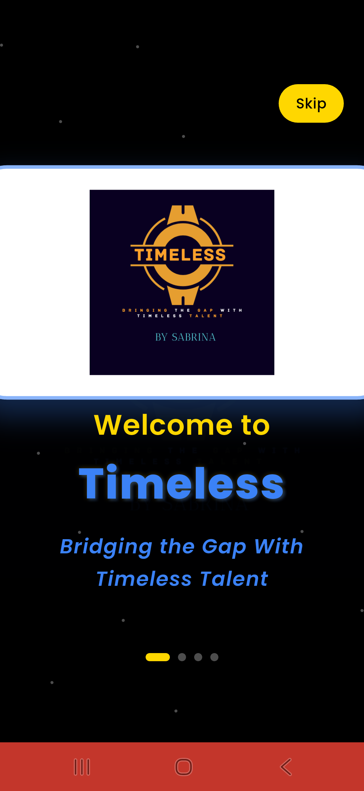
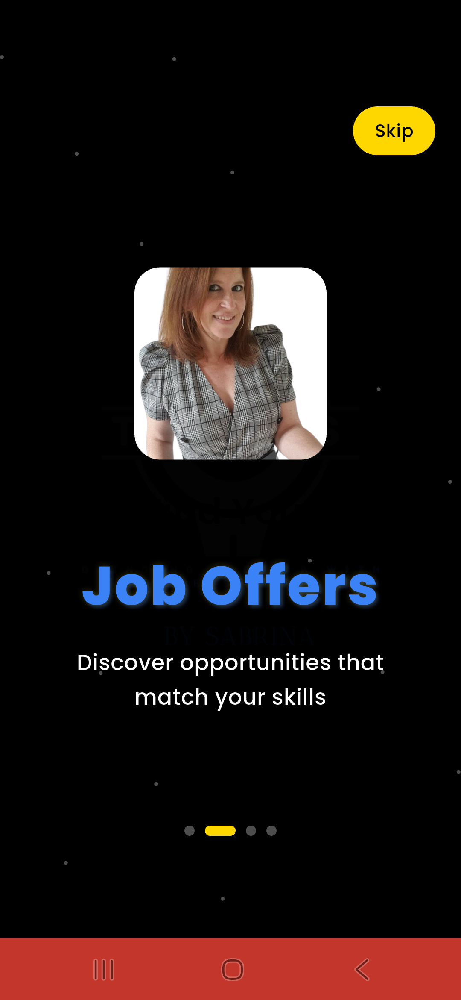
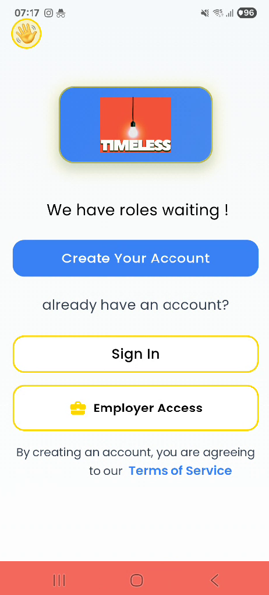
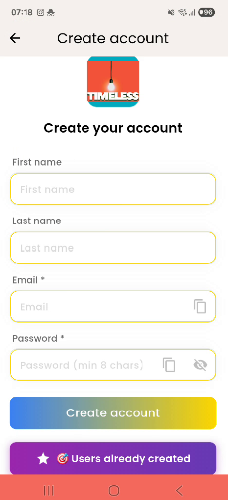
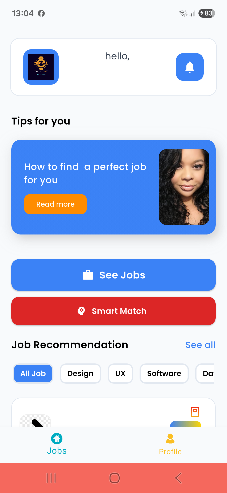
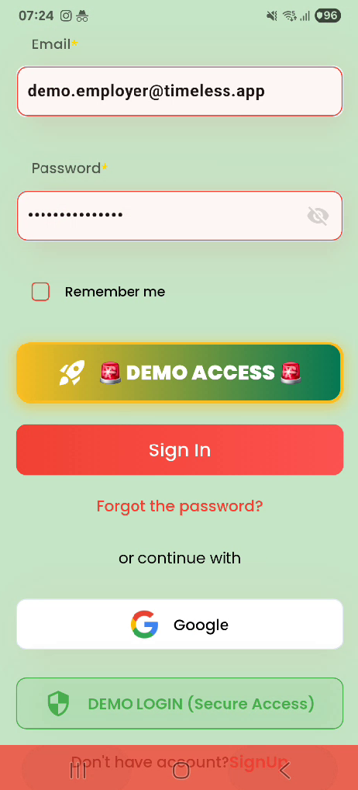
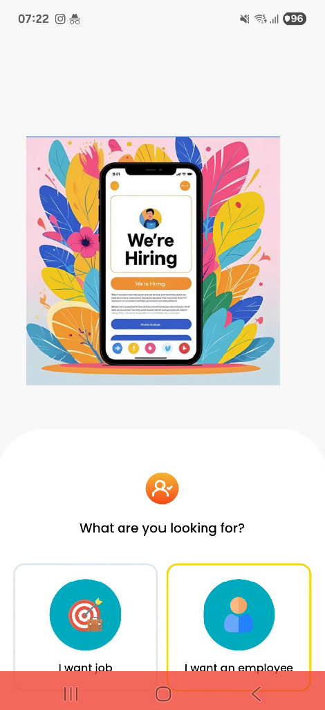
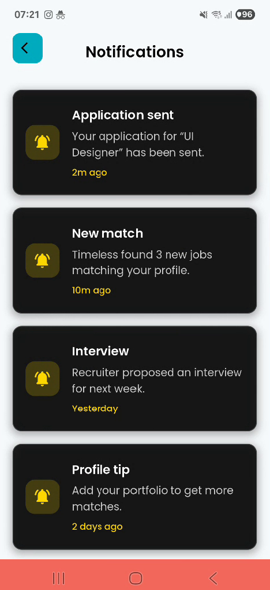

# 🚀 Timeless  
Career Companion

---

<p align="center">
  
</p>

---

<h1 align="center"></h1>
<p align="center"><em>Digital job search — Find, Apply & Grow.</em></p>

<p align="center">
  <a href="https://flutter.dev"></a>
  <a href="https://firebase.google.com"></a>
  
  
</p>

---

## ✨ Timeless – Career Companion

**Bridging the gap with timeless talent**

Timeless is a mobile app built with **Flutter** that helps candidates discover digital/tech jobs across Europe.  
It focuses on fast search, clean UX, and simple onboarding (Google, GitHub, Email/Password, or Guest Mode).  
For presentations or low-connectivity scenarios, the app includes an **Offline Demo** that loads jobs from a local JSON file.

### Features
- 🔐 **Authentication** – Secure login & signup (Firebase Auth)  
- 👤 **User Profiles** – Manage job seeker & employer accounts  
- 📊 **Dashboard** – Personalized offers & applications  
- 🔔 **Notifications** – Real-time alerts  
- 🏢 **Employer Section** – Manage job postings and candidates  

---

## 📸 Screenshots

<p align="center">
  
  
</p>
<p align="center">
  
  
</p>
<p align="center">




  
<p align="center">
 
  
  
</p>
<p align="center">
  
</p>

---

## 🛠️ Tech Stack
- **Frontend**: Flutter (Dart)  
- **Backend**: Firebase (Auth, Firestore, Storage, Cloud Functions)  
- **State Management**: GetX  
- **Platforms**: Android, iOS  

---

## 🚧 Installation

```bash
# Clone the repository
git clone https://github.com/ton-compte/timeless.git

# Move into the project folder
cd timeless

# Install dependencies
flutter pub get

# Run on a connected device or emulator
flutter run
📜 License
This project is licensed under the MIT License.

