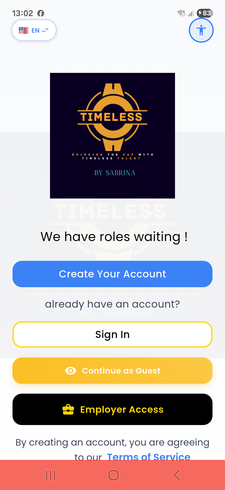
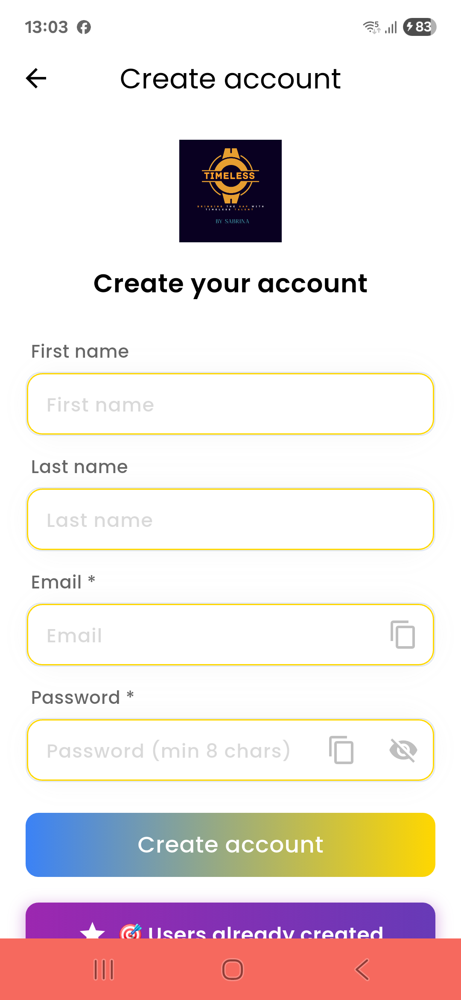
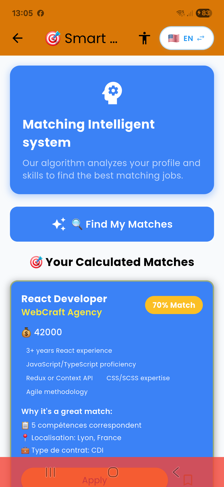
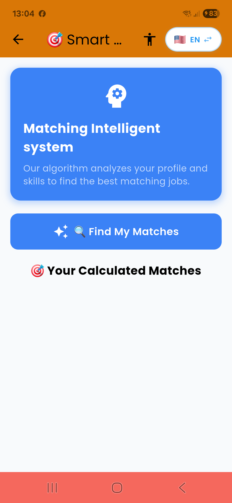

# 🚀 Timeless  
Career Companion  


<p align="center">
  👉 <a href="https://holbiwan.github.io/timeless/">Visit the Landing Page</a>
</p>

<p align="center">
  
  &nbsp;&nbsp;&nbsp;
  
</p>


<h1 align="center"></h1>
<p align="center"><em>Digital job search — Find, Apply & Grow.</em></p>  

<p align="center">
  I am still learning and developing my skills. This project is under construction.
</p>

<p align="center">
  <a href="https://flutter.dev"></a>
  <a href="https://firebase.google.com"></a>
  
  
</p>


## 📸 Screenshots (mini preview of the app pages)

<p align="center">
  <a href="assets/screenshots/First_Screen_Connex.png">
    
  </a>
  <a href="assets/screenshots/Create_Your_Account.png">
    
  </a>
  <a href="assets/screenshots/Dashboard.png">
    
  </a>
  <a href="assets/screenshots/Find_My_Matches.png">
    
  </a>
</p>

<p align="center">
  <a href="assets/screenshots/Matching_system.png">
    
  </a>
  <a href="assets/screenshots/Notifs.png">
    
  </a>
  <a href="assets/screenshots/Employer%20screen.png">
    
  </a>
  </p>


## 🎬 Demo (click on image below)

<p align="center">
  <a href="https://drive.google.com/file/d/1rluLEb_Vo9qcsesfhSVJpYSz6heZSxV8/view?usp=sharing" target="_blank">
    
  </a>
</p>


## 🛠️ Project Structure (main folders)

```bash
timeless/
├── android/         # Android settings
├── ios/             # iOS settings
├── assets/          # Images, icons, demo data
├── lib/             # Main app code
│   ├── api/         # Data services
│   ├── common/      # Reusable widgets
│   ├── screen/      # App screens
│   ├── service/     # Features (auth, storage…)
│   ├── utils/       # Helpers, constants
│   └── main.dart    # Entry point
├── test/            # Tests
└── web/             # Web settings
```

## 🛠️ Tech Stack
- **Frontend**: Flutter (Dart)  
- **Backend**: Firebase (Auth, Firestore, Storage, Cloud Functions)  
- **State Management**: GetX  
- **Platforms**: Android, iOS

## 🗄️ Data & Services
```

| Service                   | Purpose                          |
|---------------------------|----------------------------------|
| **Firebase Auth**         | Login / Signup                   |
| **Firestore**             | Job data, profiles, applications |
| **Firebase Storage**      | CVs and profile pictures         |
| **Push Notifications**    | Alerts and updates               |
| **SharedPreferences**     | Local settings and tokens        |

```
 


## 🚧 Installation

```bash
# Clone the repository
git clone https://github.com/ton-compte/timeless.git

# Move into the project folder
cd timeless

# Install dependencies
flutter pub get

# Run on a connected device or emulator
flutter run
```

## 📜 License
This project is licensed under the MIT License.


