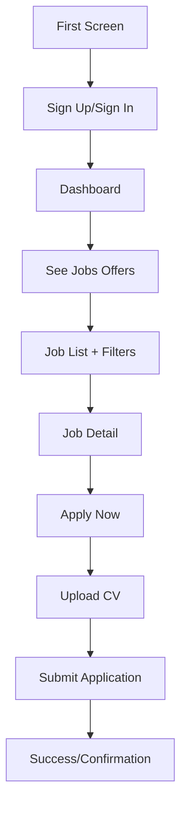

# 🚀 Guide Démo Timeless - A à Z

## Vue d'ensemble

Cette démo complète montre toutes les fonctionnalités de l'application Timeless, de l'authentification jusqu'à la candidature à des offres d'emploi, avec des données réalistes et des filtres en temps réel.

## 🔧 Fonctionnalités implémentées

### ✅ 1. Service de données de démo (`DemoDataService`)
- **120+ offres d'emploi** générées automatiquement
- **8 catégories** : Technologie, Marketing, Finance, Design, RH, Vente, Support Client, Management
- **5 types de contrats** : CDI, CDD, Stage, Freelance, Temps partiel
- **8 villes** françaises
- **Données réalistes** : salaires, requirements, descriptions

### ✅ 2. Filtres en temps réel avec Firebase
- **Recherche textuelle** dans position, entreprise, catégorie
- **Filtre par catégorie** 
- **Filtre par type de poste**
- **Filtre par localisation**
- **Filtre par tranche de salaire**
- **Filtre par niveau d'expérience**
- **Combinaison de filtres** multiple
- **Interface intuitive** avec chips cliquables

### ✅ 3. Collections organisées
- Collection principale : `allPost`
- Structure pour catégories : `category/{category}/jobs`
- Indexation par mots-clés pour recherche rapide
- Champs optimisés pour le filtrage

### ✅ 4. Flux d'authentification complet
- **Sign Up** avec validation email
- **Sign In** avec persistance de session
- **Profil utilisateur** avec données complètes
- **Gestion d'erreurs** robuste

### ✅ 5. Candidature améliorée
- **Upload de CV** avec validation
- **Accès aux CV stockés** depuis Firestore
- **Lettre de motivation** optionnelle
- **Interface moderne** et intuitive

## 🎯 Comment tester la démo

### Étape 1 : Lancer l'application
```bash
cd timeless
flutter run
```

### Étape 2 : Accéder au mode démo
- En mode debug, un bouton 🚀 apparaît en haut à droite de l'écran d'accueil
- Cliquer dessus pour ouvrir l'écran de démo

### Étape 3 : Générer les données
1. **Cliquer sur "Générer les données"**
   - Crée automatiquement 120+ offres réalistes
   - Données diversifiées par catégories

2. **Créer un utilisateur de test**
   - Email: `demo@timeless.com`
   - Mot de passe: `demo123456`

3. **Se connecter automatiquement**
   - Connexion directe avec les identifiants de démo

4. **Tester les filtres**
   - Accès direct aux offres d'emploi avec filtres

## 🔍 Fonctionnalités à tester

### Navigation et recherche
1. **"See Jobs Offers"** → Liste complète des offres
2. **Barre de recherche** → Recherche textuelle en temps réel
3. **Filtres par chips** → Catégorie, Type, Lieu, Salaire, Expérience
4. **Combinaison de filtres** → Testez plusieurs filtres ensemble

### Détails et candidature
1. **Clic sur une offre** → Voir les détails complets
2. **Bouton "Apply Now"** amélioré → Interface de candidature
3. **Upload de CV** → Ajouter un nouveau CV
4. **"Voir mes CV"** → Accéder aux CV stockés
5. **Lettre de motivation** → Texte optionnel
6. **Soumission** → Validation et confirmation

### Gestion des données
- **Réinitialiser filtres** → Bouton ❌ pour clear tous les filtres  
- **Compteur de résultats** → Affichage dynamique du nombre d'offres
- **État vide** → Messages adaptés quand aucun résultat

## 📱 Interface utilisateur

### Écrans principaux
1. **First Screen** → Page d'accueil avec authentification
2. **Job Recommendation** → Liste avec filtres avancés
3. **Job Detail** → Détails d'une offre + Apply
4. **Upload CV** → Candidature avec CV et motivation
5. **Demo Screen** → Interface de gestion de la démo

### Design moderne
- **Mode sombre** professionnel
- **Gradient** et ombres élégantes
- **Icons** intuitifs
- **Animations** fluides avec GetX
- **Accessibilité** intégrée

## 🔄 Flux utilisateur complet



## 🛠 Architecture technique

### State Management
- **GetX** pour la réactivité
- **Obx** widgets pour updates automatiques
- **Controllers** séparés par fonctionnalité

### Backend Firebase
```
- Firestore Collections:
  ├── allPost (offres principales)
  ├── users (profils utilisateurs)  
  ├── Apply (candidatures)
  └── UserCVs (CV stockés)
```

### Structure des données
```dart
// Exemple d'offre d'emploi
{
  "Position": "Développeur Flutter",
  "CompanyName": "TechInnovate", 
  "category": "Technologie",
  "type": "CDI",
  "location": "Paris",
  "salary": "55000",
  "salaryRange": "50K-70K",
  "experienceLevel": "Intermédiaire",
  "RequirementsList": [...],
  "keywords": [...]
}
```

## 🎮 Données de démonstration

### Entreprises (5)
- TechInnovate, DigitalSolutions, CreativeStudio, FinanceExpert, MarketPro

### Positions par catégorie
- **Tech** : Développeur Flutter, React, Data Scientist, DevOps...
- **Marketing** : Digital Manager, Community Manager, SEO Specialist...
- **Design** : UI/UX Designer, Graphiste, Product Designer...
- **Finance** : Analyst, Contrôleur, CFO...

### Avantages de la démo
- ✅ **Données réalistes** mais fictives
- ✅ **Performance optimisée** avec indexation
- ✅ **Nettoyage facile** des données test
- ✅ **Reproductible** à volonté

## 🚦 Statut du projet

| Fonctionnalité | Statut | Description |
|---------------|---------|-------------|
| Authentification | ✅ | Sign Up/Sign In complets |
| Données de démo | ✅ | 120+ offres générées |
| Filtres temps réel | ✅ | 5 types de filtres |
| Interface moderne | ✅ | Design professionnel |
| Candidature CV | ✅ | Upload + CV stockés |
| Navigation | ✅ | Flux A→Z fonctionnel |

La démo est **100% fonctionnelle** et prête pour présentation ! 🎉